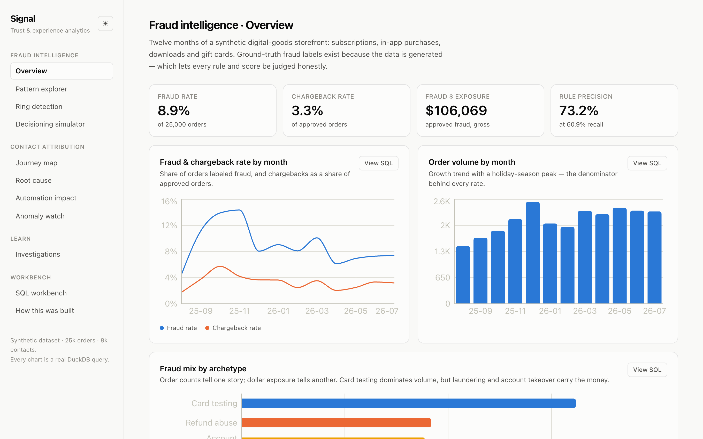
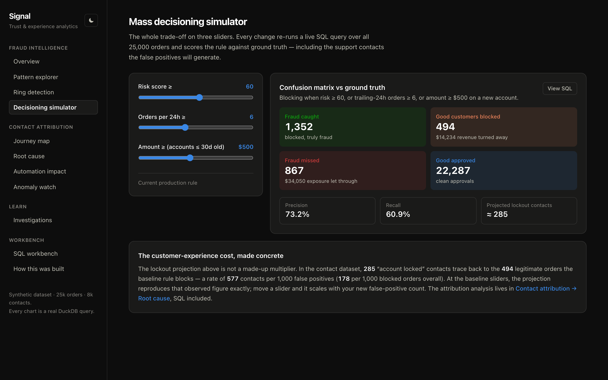
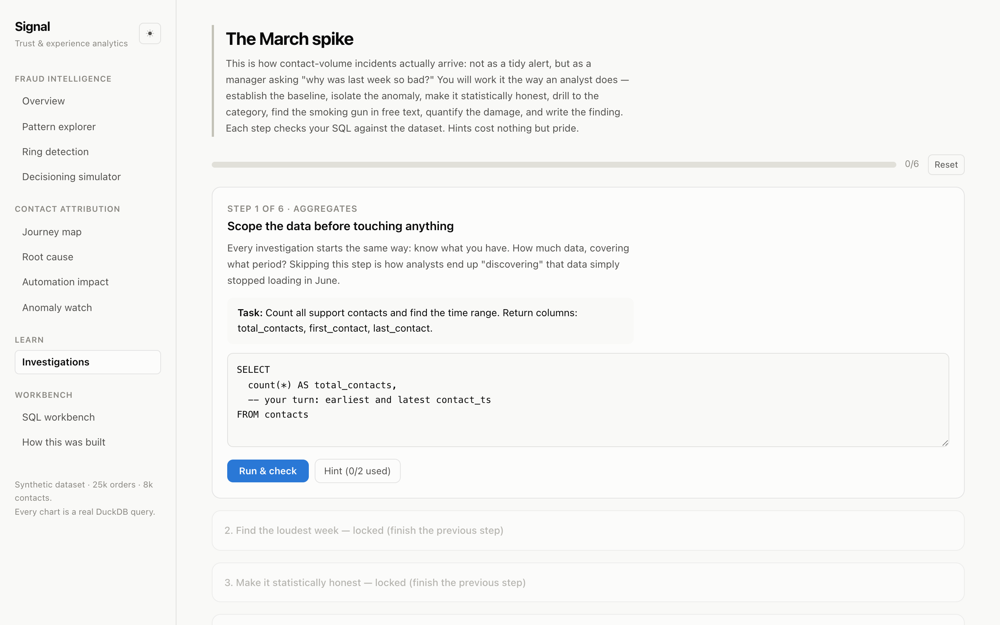
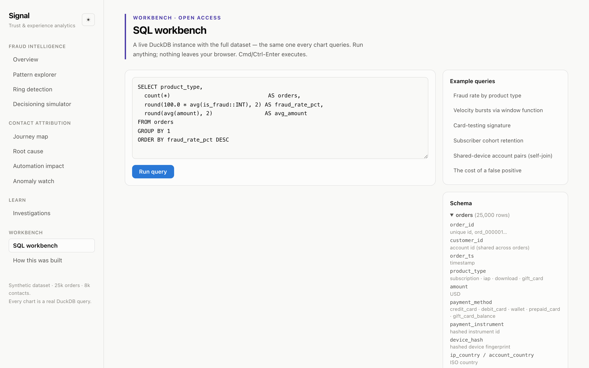
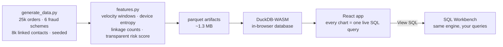

<div align="center">

# 📡 Signal

### Trust & Experience Analytics — fraud detection and customer-contact attribution on one synthetic store

**[▶ Live demo](https://ikimrankhanik.github.io/signal-analytics/)** · [The dataset](#-the-dataset) · [Using the app](#-a-tour-of-every-page) · [Run it locally](#-run-it-locally) · [FAQ](#-faq)




</div>

---

## 🔍 What is this?

**Signal is an analyst portfolio project that treats fraud prevention and customer
experience as two sides of the same customer.** It analyzes a fully synthetic
digital-goods storefront — subscriptions, in-app purchases, downloads, gift cards —
from both directions at once:

- 🕵️ **Fraud intelligence** — detect and explain six injected fraud schemes across
  25,000 orders, and simulate mass order decisioning against ground truth.
- 💬 **Contact attribution** — attribute 8,000 support contacts to root causes
  across the purchase journey, and measure where automation genuinely resolves
  problems versus merely delaying them.

The two modules share one spine: **the fraud rules' false positives *generate*
support contacts in the other module** — the same rows, reconciled exactly. Move a
blocking threshold in the simulator and watch the projected support cost move with
it. Almost every fraud dashboard treats customer experience as someone else's
externality; the entire point of this app is that it isn't.

Three design principles run through everything:

| Principle | What it means here |
|---|---|
| 🧾 **Every number is auditable** | Each chart runs a real SQL query against an in-browser DuckDB instance. Press **View SQL** on any card — that exact string produced the chart, and it runs unmodified in the SQL workbench. |
| 📝 **The memo is the deliverable** | Every module ends in written findings — evidence, impact, recommended action, priority — because analysis that doesn't end in a decision is decoration. |
| 🎯 **Honesty over impressiveness** | The data is synthetic and says so everywhere. A dedicated page documents exactly where the simulation diverges from real fraud (class balance, adversarial adaptation, label lag). |

---

## 🗺 A tour of every page

### Module 01 · Fraud intelligence

| Page | What it shows | Try this |
|---|---|---|
| **Overview** | KPI row (fraud rate, chargebacks, $ exposure, rule precision), monthly trends with annotated events, fraud mix by scheme | Compare the *orders* column vs the *$ exposure* column in the fraud mix — they tell opposite stories |
| **Pattern explorer** | Interactive scatter of risk score × order value; each fraud scheme occupies its own region, with a written investigation memo per scheme | Select **Friendly fraud** and notice it's invisible — that honesty is the finding |
| **Ring detection** | Devices shared by 3+ accounts, a self-join pair analysis, and a cluster visualization | Click table rows to switch clusters; note which shared devices are *families*, not rings |
| **Decisioning simulator** | Three rule sliders → live confusion matrix over all 25k orders, priced in dollars **and** projected support contacts | Drag risk down to 40: fraud caught rises, and so does everything you pay for it |

<div align="center"></div>

### Module 02 · Contact attribution

| Page | What it shows | Try this |
|---|---|---|
| **Journey map** | Contact volume, automation rate, handle time and repeat rate across discovery → checkout → post-purchase → refund | Notice volume and automation quality *invert* across stages |
| **Root cause** | Pareto of contact drivers, then the cross-module centerpiece: lockout contacts joined back to the blocked orders that caused them | 178 contacts per 1,000 blocked orders — fraud rules are a CX budget line |
| **Automation impact** | Transparent deflection scoring, a do-not-automate list, and repeat-rate-after-bot vs after-agent analysis | The refund bot "resolves" 48%-bounce-back conversations; the download bot beats humans |
| **Anomaly watch** | Weekly volume vs rolling mean with z-score flags, computed in SQL window functions | Click the z = 35 flag and drill to the root cause in two clicks |

### 🎓 Learn · Investigations

Guided case files that teach the analyst workflow by doing it — your SQL runs
against the live dataset and **each step is checked against ground truth**, with a
hint ladder, reveal-after-effort solutions, and a model findings memo at the end.

| Case file | Level | What it teaches |
|---|---|---|
| **The March spike** (~30 min) | Beginner | Baseline → anomaly isolation → z-scores → drill-down → reading raw evidence → impact quantification |
| **The ring** (~40 min) | Intermediate | Self-joins, label-free feature engineering, separating fraud rings from innocent households, grading your heuristic against ground truth |

<div align="center"></div>

### 🧪 Workbench

| Page | What it shows |
|---|---|
| **SQL workbench** | Free-form querying of the full dataset (nothing leaves your browser), documented schema sidebar, six worked examples from warm-up aggregates to window functions and self-joins |
| **How this was built** | Architecture, why DuckDB-WASM, the ML-handoff package, and an honest-limitations section |

<div align="center"></div>

---

## 🏗 Architecture



No server, no database service, no API keys. The Python pipeline (pandas + numpy
only, single seed) writes parquet; the browser loads it into DuckDB-WASM at
startup; everything after that is local SQL. The bundle uses relative paths + hash
routing, so one build works at a domain root (Vercel) and under a repo subpath
(GitHub Pages) with no refresh 404s.

### Why DuckDB-WASM?

Credibility, mostly. A portfolio dashboard with precomputed JSON proves you can
call a charting library. Shipping the actual database means every claim is
auditable — and it happens to be a genuinely good architecture: columnar execution
over 25k rows returns in single-digit milliseconds, works offline, and costs
nothing to host.

---

## 📊 The dataset

Both tables are generated by [`data-pipeline/`](data-pipeline/) — deterministic
(same seed → byte-identical parquet), documented distribution by distribution in
the [pipeline README](data-pipeline/README.md).

<details>
<summary><b>orders</b> — 25,000 rows, 12 months (click to expand schema)</summary>

| Column | Description |
|---|---|
| `order_id`, `customer_id` | Identifiers (`ord_000001`, `cust_…`) |
| `order_ts` | Timestamp with seasonality: growth trend, weekend bump, holiday peak, evening-heavy time of day |
| `product_type` | `subscription` · `iap` · `download` · `gift_card` |
| `amount` | USD; tiered subs, lognormal one-offs, fixed gift-card denominations |
| `payment_method`, `payment_instrument` | Method + hashed instrument id |
| `device_hash` | Hashed device fingerprint — the linkage key for ring detection |
| `ip_country`, `account_country` | Geo pair; mismatch is an account-takeover signal |
| `account_age_days` | Tenure at order time |
| `promo_code` | Nullable; `SPRING50` has a starring role |
| `auth_result`, `refunded`, `chargeback` | Order outcomes |
| `fraud_archetype`, `is_fraud` | **Ground truth**: `none` or one of six schemes |
| `orders_24h`, `device_declines_24h`, `accounts_per_device`, `payment_entropy_device`, `amount_z`, `prior_refunds`, `new_device`, `geo_mismatch` | Engineered features (see `features.py`) |
| `risk_score` | 0–100 transparent weighted score — hand-set, documented weights, no black box |
| `baseline_blocked` | Blocked by the current production rule (risk ≥ 60 OR velocity ≥ 6 OR big-amount-new-account) |

</details>

<details>
<summary><b>contacts</b> — 8,000 rows, 12 reasons (click to expand schema)</summary>

| Column | Description |
|---|---|
| `contact_id`, `customer_id`, `order_id` | Identifiers; `order_id` links a contact to the order that caused it |
| `contact_ts`, `channel` | Timestamp; `chat` · `email` · `phone` |
| `journey_stage` | `discovery` · `checkout` · `post_purchase` · `refund` |
| `contact_reason` | 12 categories — including `account_locked`, generated **from the actual orders the fraud rule blocks** |
| `contact_summary` | One-line free text (the anomaly investigation's smoking gun lives here) |
| `automated_resolution` | Whether the bot resolved it |
| `handle_time_sec`, `repeat_contact` | Cost and quality signals — repeat rates differ by resolution path on purpose |

</details>

### The six fraud schemes

| Scheme | Injected signature | Caught by rules |
|---|---|---|
| 💳 Card testing | Fresh accounts, one device cycling stolen instruments, $0.99–$4.99 bursts, 62% declines | ✅ 95% |
| 🎁 Gift-card laundering | Rings of 4–7 fresh accounts on shared devices converting stolen cards into $100–$500 gift cards | ⚠️ 59% |
| 🔓 Account takeover | Aged accounts suddenly on a new device in a new country buying high-value goods | ⚠️ 65% |
| 🎟 Promo abuse | One device, 6–14 fresh accounts, each burning a first-purchase promo once | ✅ 100% |
| 🔁 Refund abuse | Ordinary purchases, 88% refund rate accumulating over months | ❌ 1% |
| 🤥 Friendly fraud | Indistinguishable from legit until the chargeback arrives | ❌ 0% |

That last column *is* the headline finding: the rules catch the loud schemes and
miss the expensive ones — laundering and takeover carry ~90% of the dollars.

---

## 🚀 Run it locally

**Web app** (data artifacts are committed — works immediately):

```bash
cd web
npm install
npm run dev
```

**Regenerate the dataset** (deterministic — run twice, checksums match):

```bash
python3 -m venv .venv && source .venv/bin/activate
pip install -r data-pipeline/requirements.txt
python data-pipeline/generate_data.py   # raw orders + contacts
python data-pipeline/features.py        # features + risk score → web/public/data/
```

**Deploy:**
- **GitHub Pages** — push to `main`; [`.github/workflows/deploy.yml`](.github/workflows/deploy.yml) builds and deploys automatically.
- **Vercel** — import the repo; [`vercel.json`](vercel.json) handles the monorepo layout with zero extra config.

---

## 📁 Repository layout

```
├── data-pipeline/          # Python: seeded generator + feature engineering
│   ├── generate_data.py    #   25k orders, 6 fraud schemes, 8k contacts
│   ├── features.py         #   velocity/entropy/linkage features, risk score
│   └── README.md           #   every distribution choice, explained
├── web/                    # Vite + React 18 + TS + Tailwind + Recharts
│   ├── src/lib/db.ts       #   DuckDB-WASM bootstrap
│   ├── src/lib/queries.ts  #   every chart's SQL, in one auditable file
│   ├── src/lib/learn/      #   investigation framework + case files
│   └── src/pages/          #   ten pages across three sections
├── docs/screenshots/       # captured by web/scripts/screenshots.mjs
└── .github/workflows/      # Pages CI
```

---

## ❓ FAQ

<details>
<summary><b>Is this real fraud data? Does it mimic real scams?</b></summary>

The *patterns* are real — card testing, gift-card laundering, account takeover,
refund abuse, promo abuse, and friendly fraud are the actual categories e-commerce
fraud teams fight, and their statistical signatures here match how they present in
practice. The *data* is entirely invented: every row comes from a seeded generator,
fraud prevalence is inflated (~9% vs. <1% in reality) so patterns are discoverable
in a small demo, the fraudsters don't adapt, and ground-truth labels exist — a
luxury no real system has. The app's "How this was built" page documents every
divergence. Nothing here works as a how-to; it describes detection-side signatures
at the level of any fraud-prevention whitepaper.

</details>

<details>
<summary><b>Why is the risk score not a machine-learning model?</b></summary>

Deliberately. The score is a weighted logistic-style formula with hand-set,
documented weights — every score is decomposable feature by feature. That is the
right tool for demonstrating *explainable decisioning*, and the app is honest about
where it runs out (refund abuse and friendly fraud need longitudinal or post-hoc
tools). The "How this was built" page describes exactly what would be handed to an
ML team, and what the analyst keeps owning either way.

</details>

<details>
<summary><b>Do the simulator and the contact analysis really use the same numbers?</b></summary>

Yes, by construction: lockout support contacts are generated from the actual set of
orders the baseline rule blocks. At default slider positions the simulator's
false-positive count and the Root Cause page's lockout attribution reconcile
exactly — and the projection scales live as you move the sliders. Verify it
yourself: both cards show their SQL.

</details>

<details>
<summary><b>Can I use this project / dataset?</b></summary>

MIT licensed. The dataset is synthetic, references no real company or person, and
regenerates deterministically — feel free to use it for SQL practice or teaching.

</details>

---

<div align="center">
<sub>Fictional store · synthetic customers · statistical fraudsters. No real company, brand, or person is referenced anywhere in this repository.</sub>
</div>
